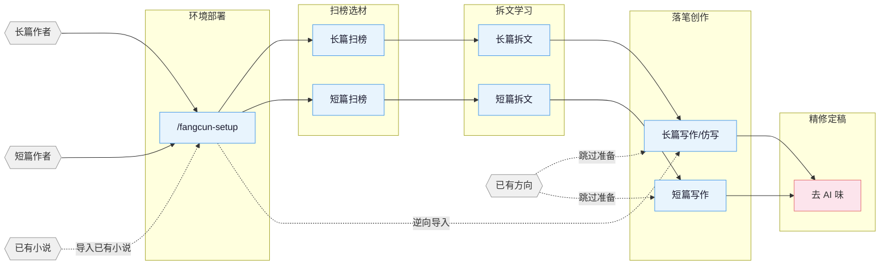

English | **中文**

# fangcun-write

方寸网文写作 skill 包，覆盖长篇与短篇网络小说的扫榜、拆文、写作、去AI味、封面图全流程。支持章对章仿写和续写两种模式。适配 Claude Code、OpenCode、OpenClaw。

## 核心思路

> **套路 = 确定性的情绪满足**

专业作者的方法论三步走：

1. **扫榜**：分析热门榜单，洞察题材、人设、切入点。
2. **拆文**：拆解大纲节奏与剧情素材，建立个人模块库。
3. **商业化写作**：学习并运用钩子、爽感、期待感等核心技巧。

围绕四条线展开：爆款逆向 · 剧情模块化重组 · 上下文状态分层管理 · 人机协同。

## 流程总览



## 安装

**方式一** 直接告诉 Claude Code / OpenCode / OpenClaw：

```
安装这个 skill https://github.com/your-username/fangcun-write
```

**方式二** 命令行：

```bash
npx skills add your-username/fangcun-write -y -g
```

`-g` 全局安装，所有目录可用；去掉 `-g` 则只装到当前目录。更新时重新执行同一条命令即可。

> **OpenCode 用户：** 全局安装后，opencode 会自动从 `~/.claude/skills/` 发现 skills。首次使用时，用自然语言触发 fangcun-setup（如「请使用 fangcun-setup skill，帮我部署网文写作环境」），它会自动检测 OpenCode 环境并部署对应的 agents、commands 和插件。
>
> **首次部署后必须重启 opencode**（退出后执行 `opencode -c`），`.opencode/commands/` 下的 slash command 才会生效。之后 `/fangcun-setup`、`/fangcun-write` 等命令即可直接使用。

> **多 agent 协作要先部署再新开会话**：7 个专业 agent（fangcun-architect、narrative-writer、consistency-checker 等）由 `/fangcun-setup` 写入项目 `.claude/agents/`。Claude Code 只在**会话启动时**注册 custom agent，所以 **`/fangcun-setup` 跑完必须新开一个 Claude Code 会话**，fangcun-review 的多视角对抗审查、写作流程里的 agent 协作才会生效；否则 skill 会拿到「subagent_type 不可用」并降级 solo（单视角）。

## Skills

| Skill | 触发 | 说明 |
|:------|:-----|:-----|
| `fangcun-setup` | `/fangcun-setup` `/准备写书` | 环境部署 · hooks/rules/agents/CLAUDE.md 一键部署 |
| `fangcun` | `/fangcun` `/网文` | 工具箱路由 · 模糊意图自动分发到对应 skill |
| `fangcun-write` | `/fangcun-write` `/写长篇` `/仿写` | 长篇写作 · 章对章仿写、大纲搭建、人物设定、正文输出 |
| `fangcun-long-analyze` | `/fangcun-long-analyze` | 长篇拆文 · 黄金三章、爽点设计、节奏分析 |
| `fangcun-long-scan` | `/fangcun-long-scan` | 长篇扫榜 · 起点/番茄/晋江市场趋势 |
| `fangcun-deslop` | `/fangcun-deslop` `/去AI味` | 去AI味 · 检测并清除 AI 写作痕迹 |
| `fangcun-review` | `/fangcun-review` `/审查` | 多视角审查 · 4 Agent 多视角审稿 + 番茄/起点/知乎评分标准 |
| `fangcun-cover` | `/fangcun-cover` `/封面` | 封面生成 · 书名题材分析 + GPT-Image-2 出图 |
| `browser-cdp` | `/browser-cdp` | 浏览器操控 · CDP 协议复用登录态抓取数据 |

自然语言同样触发：
- 「帮我开书」→ `fangcun-write`
- 「仿写这本书」→ `fangcun-write`（仿写模式）
- 「这篇太 AI 了」→ `fangcun-deslop`
- 「把我的书导进来」→ `story-import`

## Agent 体系

写作 skill 内部通过 7 个专业 Agent 协作，各司其职：

| Agent | 模型 | 职责 |
|:------|:-----|:-----|
| **fangcun-architect** | Opus | 故事架构 · 题材定位、大纲结构、钩子/反转设计、情绪弧线 |
| **character-designer** | Sonnet | 角色设计 · 角色档案、语言风格、动机链、对话创作 |
| **narrative-writer** | Sonnet | 叙事写手 · 正文写作、去AI味、格式合规 |
| **consistency-checker** | Haiku | 一致性检查 · 事实冲突扫描、伏笔追踪、S1-S4 分级报告 |
| **fangcun-researcher** | Sonnet | 资料研究 · CDP 搜索+正文提取、多源交叉验证、结构化参考文件输出 |
| **fangcun-explorer** | Haiku | 故事查询 · 角色/伏笔/设定/进度只读查询，日更上下文快速加载 |
| **chapter-extractor** | Haiku | 章节提取 · 摘要+情节点+角色提及，并行拆文核心单元 |

Agent 按需加载 `references/` 中的写作理论（角色设计、对话技法、反转工具箱等 100+ 份方法论文件），不预占上下文。

## 自动化 Hooks

`/fangcun-setup` 部署后自动生效的 7 个 hook：

| Hook | 触发时机 | 功能 |
|:-----|:---------|:-----|
| session-start.sh | 会话开始 | 显示分支、进度快照、拆文状态 |
| session-end.sh | 会话结束 | 记录会话日志到 `追踪/session-log.txt` |
| detect-fangcun-gaps.sh | 会话开始 | 检测设定缺口、大纲缺失、伏笔断线 |
| pre-compact.sh | 上下文压缩前 | 保存进度快照路径和行数摘要 |
| post-compact.sh | 上下文压缩后 | 提示读取进度快照恢复上下文 |
| validate-fangcun-commit.sh | git commit 时 | 检查硬编码属性、设定必填字段（仅警告，不阻断） |
| guard-outline-before-prose.sh | 写正文前（Write/Edit） | 缺对应细纲/小节大纲时阻止首次创建正文（阻断），强制先搭大纲 |

## 项目文件结构

一部长篇动辄几十万字、几百章。设定冲突、伏笔断线、时间线对不上——写到最后全靠记忆硬撑，迟早翻车。

用文件系统把设定、大纲、正文、追踪拆开，每个维度独立维护。对话只负责创作，不负责记忆。

**长篇：**

```
{书名}/
├── 设定/
│   ├── 世界观/          # 背景、力量体系等，按主题拆文件
│   ├── 角色/            # 每个人物一个文件
│   ├── 势力/            # 每个势力/组织一个文件
│   ├── 关系.md          # 角色关系映射
│   └── 题材定位.md      # 题材核心梗+对标分析
├── 大纲/
│   ├── 大纲.md          # 全书卷级结构
│   ├── 卷纲_第一卷.md   # 每卷一个：爽点节奏+情绪弧线+人物弧线+伏笔+反转
│   ├── 细纲_第001章.md  # 每章一个：内容概括+多线情节+人物关系/出场顺序+钩子
│   └── ...
├── 正文/
│   ├── 第001章_章名.md
│   └── ...
├── 对标/                # 对标参考（结构化子目录从拆文库同步）
│   └── {对标书名}/
│       ├── 原文/            # 对标书原文章节
│       ├── 角色/            # 结构化角色卡
│       ├── 剧情/            # 结构化剧情线/节奏/情绪模块
│       ├── 设定/            # 结构化设定
│       ├── 文风.md          # 日更前读取，用来贴近对标书文风
│       └── 拆文报告.md      # analyze skill 输出的拆文报告
├── 追踪/                # 连续性管理（分层追踪）
│   ├── 上下文.md        # 写作上下文（compact 恢复用）
│   ├── 伏笔.md          # 伏笔埋设/回收状态表（跨卷级）
│   ├── 时间线.md        # 故事内时间线（全书级）
│   └── 角色状态.md      # 角色当前状态快照（章节级）
├── 参考资料/            # fangcun-researcher 输出的研究资料
│   └── {topic}.md       # 按研究主题拆分
```

**短篇：**

```
短篇/{标题}/
├── 正文.md              # 完成稿
├── 小节大纲.md          # 8 节结构 + 情绪曲线
└── 拆文库/              # 如有参考小说（analyze 输出）
    └── {书名}/
        ├── 拆文报告.md
        ├── 情节节点.md
        └── 写作手法.md
```

**拆文库：** 拆文 skill 默认输出到项目根目录 `拆文库/{书名}/`，产出结构化目录（角色/剧情/设定/章节），其中长篇剧情目录包含 `节奏.md` 和 `情绪模块.md`，是 analyze 的源数据（source of truth）。写作 skill 通过 `对标/{书名}/剧情/` 等子目录消费这些资产（项目级引用视图），或自动回退读取 `拆文库/`。

**`.active-book`：** 项目根目录的文本文件，内容是当前活跃书目的**相对路径**（如 `长篇/我的小说`），hook 和写作 skill 据此定位当前项目。

## 知识体系

各 skill 自带 `references/` 知识库，按需加载，不占上下文。

<details>
<summary>展开各 skill 知识库主题清单</summary>

| 主题 | 内容 | 所在 skill |
|:-----|:-----|:-----------|
| 大纲排布 | 五步大纲法 · 故事结构分级 · 节点设计法 · 升级感设计 | fangcun-write |
| 开头设计 | 开篇模式 · 前 500 字设计 · 黄金三章开头策略 | fangcun-write |
| 人物设计 | 角色设定 · 人物提取 · 关系映射 · 动机链 · 群像 | fangcun-write |
| 钩子技法 | 章尾钩子 13 式 · 章首钩子 7 式 · 段落级钩子 · 悬念编排 | fangcun-write |
| 情绪设计 | 6 种弧形模板 · 期待感管理 · 题材赛道策略 | fangcun-write |
| 题材框架 | 长篇八节点 · 短篇压缩三幕 · 8 大题材开头模板 | fangcun-write |
| 对话技法 | 节奏 · 潜台词 · 信息控制 · 对话模式数据库 | fangcun-write |
| 反转工具箱 | 类型 · 时机 · 误导底层路径 | fangcun-write |
| 风格模块 | 对话 · 打斗 · 智斗 · 镜头式写作 · 装逼打脸 · 白描 | fangcun-write |
| 高级技法 | 小纲四步法 · 高潮逆推 · 双线结构 · AB 交织法 | fangcun-write |
| 去AI味 | 预防 · 三遍去AI法 · 改写范例库 · 禁用词表 | fangcun-deslop |
| 质量检查 | 通用 · 长篇专项 · 短篇专项 · 毒点排查 | fangcun-write |
| 拆文方法 | 黄金三章 · 情绪曲线 · 结构拆解 · 知乎风格分析 | fangcun-long-analyze |
| 读者画像 | 9 维画像 · 目标读者分析 | fangcun-long-scan |
| 市场数据 | 题材趋势 · 平台特性 · 采集格式 · 投稿指南 | fangcun-long-scan |
| 封面风格 | 10 大题材视觉风格 · 色彩构图 · 提示词模板 | fangcun-cover |
| 多视角审稿 | 多视角审稿 · 评分标准 · 毒点排查 | fangcun-review |

</details>

## 适用平台

**长篇** 起点中文网 · 番茄小说 · 晋江文学城 · 七猫小说 · 刺猬猫

**短篇** 知乎盐言故事 · 番茄短篇 · 七猫短篇

## 特色功能

### 章对章仿写

fangcun-write 独有的仿写模式，保留源文的情绪弧线和叙事骨架，换掉人名、地名、具体情节：

```
源文分析 → 事件提取 → 章纲生成 → 逐章写作 → 对比审核
```

- **信息释放清单**：每章只告诉 LLM "释放什么信息"，不给源文细节
- **动态禁用清单**：从源文提取本章不可复用的元素
- **角色名映射**：自动替换角色名（XML格式）
- **风格指纹**：提取源文句长/对话比/标点节奏
- **对比审核**：生成源文vs新书的对比报告

## 贡献

欢迎贡献新 skill、补充知识库、更新市场数据。

## 交流

- **GitHub Discussions**：[提问 / 求助 / 分享用法](https://github.com/your-username/fangcun-write/discussions)

## 致谢

- [oh-story-claudecode](https://github.com/worldwonderer/oh-story-claudecode) — skill 架构参考
- [LINUX DO - The New Ideal Community](https://linux.do) — 社区支持
